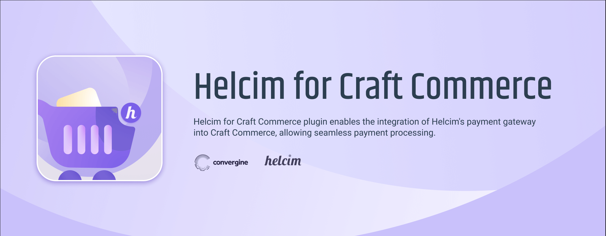
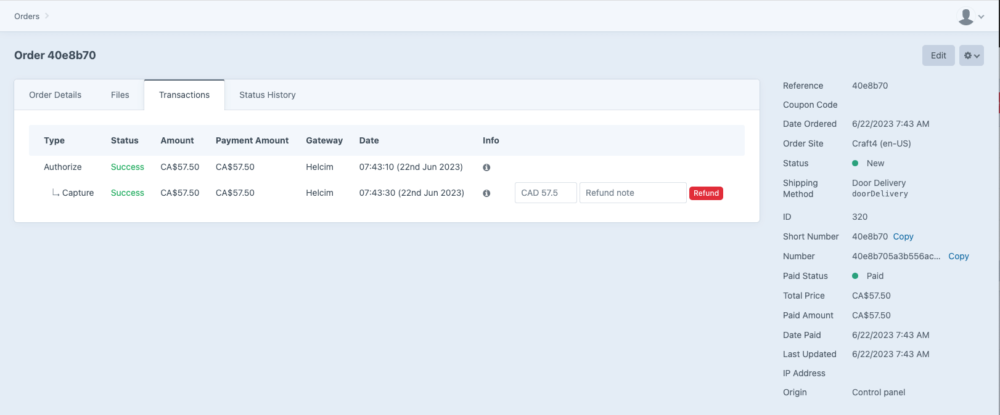
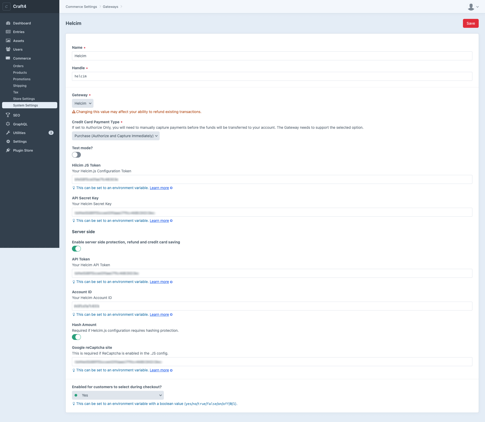

# Helcim for Craft Commerce 4.x


This plugin integrates Craft Commerce with a [Helcim](https://www.helcim.com) payment gateway. 

The frontend is using [Helcim.JS](https://devdocs.helcim.com/docs/overview-of-helcimjs) payment method to securely process & store credit card data on Helcim portal (PCI-DSS compliant method).

The backend functions are using [Helcim API](https://devdocs.helcim.com/docs/overview-of-helcim-api) to process payments from admin and issue refunds.

## Features
- [x] Standard payments (Helcim.JS payment method)
  - [x] Authorize Only: Ability to authorize credit card payments without capturing funds immediately.
  - [x] Purchase: Capability to process credit card payments and capture funds in real-time.
- [x] PCI-DSS compliant method to securely process & store credit card data on Helcim portal
- [x] Ability to save credit card data on Helcim portal for future use
- [x] Full refunds for payments (Must be initiated from the CraftCMS)
- [x] Payment from Frontend and Backend: Conveniently accept payments from the frontend of your Craft Commerce website, allowing customers to make purchases, and from the backend administrative interface for manual order processing.

The plugin DOES NOT support the following features:
- [ ] Partial Refunds
- [ ] Recurring Payments

## Known Limitations & Issues
- If plugin is configured for PreAuth method, the backend does not provide the "make payment" option. It exclusively supports the "Capture" functionality due to a restriction imposed by Helcim.
- The plugin does not offer the capability of initiating partial refunds. Partial refunds will be addressed in the future.
- Due to Helcim's policy, subsequent payments for the same order are not allowed once payment has been processed and refunded.
- The backend lacks updates from Helcim Portal to synchronize payment activities such as refunds or payments initiated on Helcim Portal. Craft Commerce will not reflect these updates/transactions. This functionality is not supported by Helcim.

## Requirements

- This plugin requires Craft Commerce 4.0.0 or later.

## Installation

You can install this plugin from the Plugin Store or with Composer.

#### From the Plugin Store

Go to the Plugin Store in your project’s Control Panel and search for “Helcim”. Then click on the “Install” button in its modal window.

#### With Composer

Open your terminal and run the following commands:

```bash
# go to the project directory
cd /path/to/my-project.test

# tell Composer to load the plugin
composer require convergine/commerce-helcim

# tell Craft to install the plugin
./craft plugin/install commerce-helcim
```


## Support

For any issues or questions, you can reach us by email info@convergine.com or by opening an issue on GitHub.



